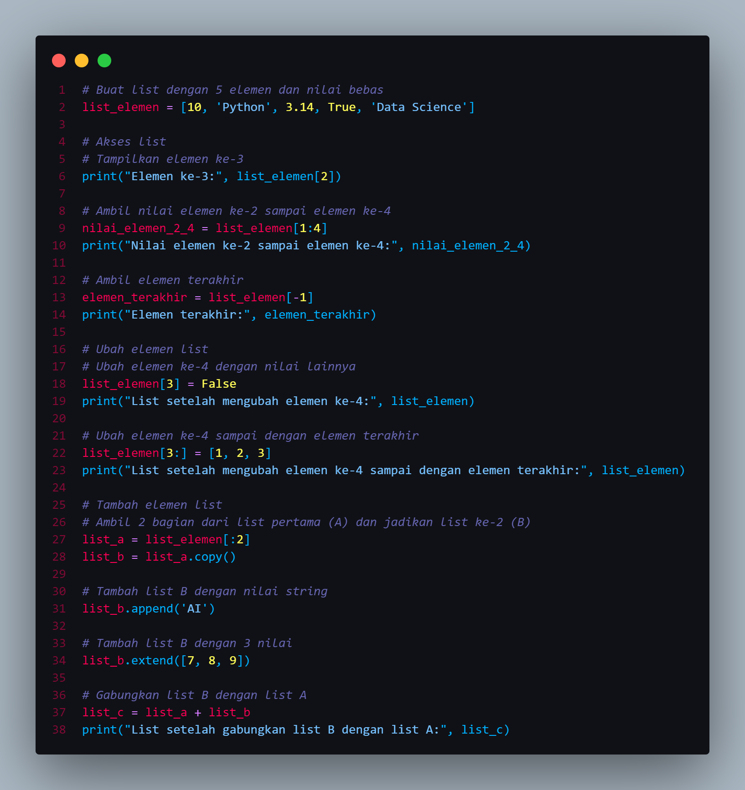
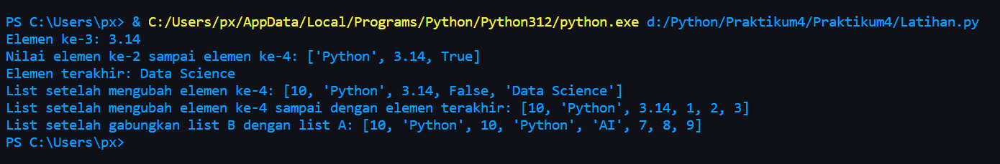
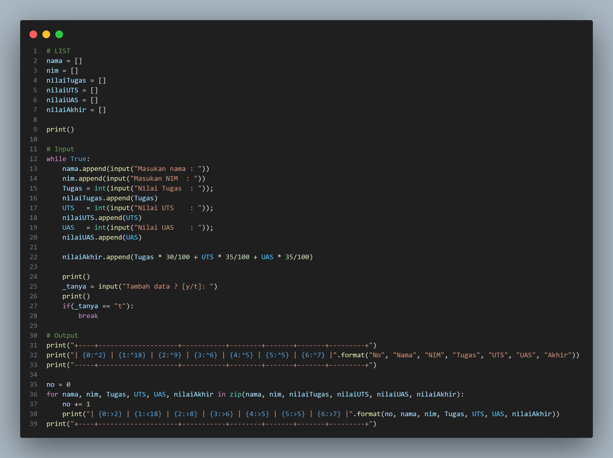
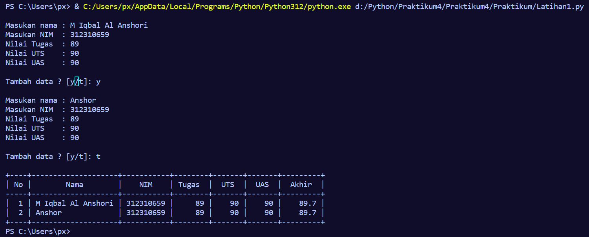

<H1>LATIHAN</H1>
<H2>1. Buat sebuah list sebanyak 5 elemen dengan nilai bebas</H2>

list_elemen = [10, 'Python', 3.14, True, 'Data Sci

<H2>2. Akses list :</H2>
A. Tampilkan elemen ke-3

print("Elemen ke-3:", list_elemen[2])

B. Ambil nilai elemen ke-2 sampai elemen ke-4

nilai_elemen_2_4 = list_elemen[1:4]
print("Nilai elemen ke-2 sampai elemen ke-4:", nilai_elemen_2_4)

C. Ambil elemen terakhir

elemen_terakhir = list_elemen[-1]
print("Elemen terakhir:", elemen_terakhir)

<H2>3. Ubah elemen list :</H2>
A. Ubah elemen ke-4 dengan nilai lainnya

list_elemen[3] = False
print("List setelah mengubah elemen ke-4:", list_elemen)

B. Ubah elemen ke-4 sampai dengan elemen terakhir

list_elemen[3:] = [1, 2, 3]
print("List setelah mengubah elemen ke-4 sampai dengan elemen terakhir:", list_elemen)

<H2>4. Tambah elemen list :</H2>
A. Ambil 2 bagian dari list pertama (A) dan jadikan list ke-2 (B)

list_a = list_elemen[:2]
list_b = list_a.copy()

B. Tambah list B dengan nilai string

list_b.append('AI')

C. Tambah list B dengan 3 nilai

list_b.extend([7, 8, 9])

D. Gabungkan list B dengan list A

list_c = list_a + list_b
print("List setelah gabungkan list B dengan list A:", list_c)

INI ADALAH TAMPILAN KODE PROGRAMNYA :

INI ADALAH HASIL OUTPUTNYA :

<H1>PRAKTIKUM</H1>
# LIST
nama = []
nim = []
nilaiTugas = []
nilaiUTS = []
nilaiUAS = []
nilaiAkhir = []

print()

# Input
while True:
    nama.append(input("Masukan nama : "))
    nim.append(input("Masukan NIM  : "))
    Tugas = int(input("Nilai Tugas  : ")); 
    nilaiTugas.append(Tugas)
    UTS   = int(input("Nilai UTS    : ")); 
    nilaiUTS.append(UTS)
    UAS   = int(input("Nilai UAS    : ")); 
    nilaiUAS.append(UAS)

    nilaiAkhir.append(Tugas * 30/100 + UTS * 35/100 + UAS * 35/100)

    print()
    _tanya = input("Tambah data ? [y/t]: ")
    print()
    if(_tanya == "t"):
        break

# Output
print("+----+--------------------+-----------+--------+-------+-------+---------+")
print("| {0:^2} | {1:^18} | {2:^9} | {3:^6} | {4:^5} | {5:^5} | {6:^7} |".format("No", "Nama", "NIM", "Tugas", "UTS", "UAS", "Akhir"))
print("-----+--------------------+-----------+--------+-------+-------+---------+")

no = 0
for nama, nim, Tugas, UTS, UAS, nilaiAkhir in zip(nama, nim, nilaiTugas, nilaiUTS, nilaiUAS, nilaiAkhir):
    no += 1    
    print("| {0:>2} | {1:<18} | {2:>8} | {3:>6} | {4:>5} | {5:>5} | {6:>7} |".format(no, nama, nim, Tugas, UTS, UAS, nilaiAkhir))
print("+----+--------------------+-----------+--------+-------+-------+---------+")

INI ADALAH TAMPILAN KODE PROGRAMNYA :

INI ADALAH HASIL OUTPUTNYA :

